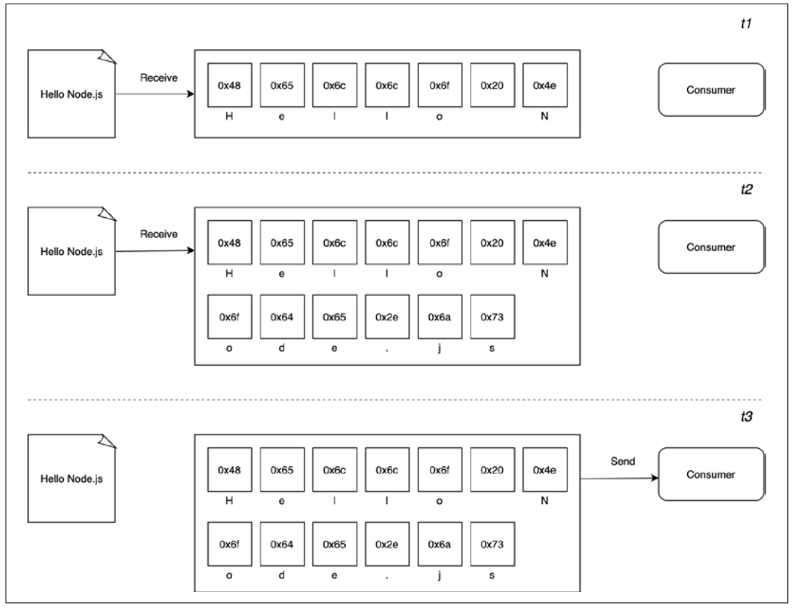

---
# try also 'default' to start simple
theme: default
# random image from a curated Unsplash collection by Anthony
# like them? see https://unsplash.com/collections/94734566/slidev
# apply any windi css classes to the current slide
class: 'text-center'
# https://sli.dev/custom/highlighters.html
highlighter: shiki
# show line numbers in code blocks
lineNumbers: true
# some information about the slides, markdown enabled
info: |
  ## Slidev Starter Template
  Presentation slides for developers.

  Learn more at [Sli.dev](https://sli.dev)
# persist drawings in exports and build
drawings:
  persist: false
---

# Using buffers and streams

---

# Good morning! 👋🏻

Same deal as yesterday:

- Pull down the repo with today's slides and exercises.
- Have a think about a takeaway from last Monday.

---

By the end of this section, you'll:
- Understand the anatomy of a Buffer instance.
- Safely and unsafely create buffers.
- Convert between buffers and other data structures.

---
layout: two-cols
---

# What is a buffer?

All of the APIs we've used so far have been in buffer mode. For an input operation, buffer mode causes all the data coming from a resource to be collected into a buffer until the operation is completed. It is then passed back to the caller as one single blob of data.

::right::

<!--  -->

---

# The Buffer Instance

<v-clicks>

- When it was first introduced to Node, JS didn't have a native binary type
- We now have ArrayBuffer and a number of Typed Arrays to provide different "views" of a buffer
- Full list of these on [MDN](https://developer.mozilla.org/en-US/docs/Web/JavaScript/Typed_arrays)
- When these new structures were added to JS, the Buffer constructor internals were refactored
- So, a buffer object is both an instance of Buffer and an instance of Uint8Array
- That means we can use the full API of [Uint8Array](https://developer.mozilla.org/en-US/docs/Web/JavaScript/Reference/Global_Objects/Uint8Array) as well as the [Buffer methods](https://nodejs.org/dist/latest-v12.x/docs/api/buffer.html)

</v-clicks>

---

# Allocating Buffers

<v-clicks>

> You'll rarely need to allocate a buffer but if you do, don't use the new keyword with Buffer constructor.

The correct way to allocate a buffer of a certain amount of bytes is:

```js
const buffer = Buffer.alloc(10)
```

This is the safe way to allocate buffers - the unsafe way is:

```js
const buffer = Buffer.allocUnsafe(10)
```

</v-clicks>

---

# Converting String to Buffers

<v-clicks>

You can create buffer from a string:

```js
const buffer = Buffer.from("This is a string.")
```

In order to convert a string, an encoding is assumed. The default encoding is UTF8. Be careful with string lengths!

You can set the encoding with a second parameter:

```js
const buffer = Buffer.from("This is a string", "utf16le")
```

The supported byte-to-text encodings are hex and base64. Supplying one of these encodings allows us to represent the data in a string, this can be useful for sending data across the wire in a safe format.


</v-clicks>

---

# Converting Buffers to Strings

<v-clicks>

To convert a buffer to a string, call the toString method on a Buffer instance.

Be careful to decode with the same method as it was encoded (duh!).

The UTF8 encoding format has between 1 and 4 bytes to represent each character, if for any reason one or more bytes is truncated from a character this will result in encoding errors.

So in situations where we have multiple buffers that might split characters across a byte boundary the Node core string_decoder module should be used.

</v-clicks>

---

# JSON Serializing and Deserializing Buffers

<v-clicks>

When JSON.stringify encounters any object it will attempt to call a toJSON method on that object if it exists. 

The Buffer `toJSON` method returns a JS object to represent the Buffer in a JSON-friendly way.


</v-clicks>

---

# What about streams?

<v-clicks>

- Motto in the community to "stream all the things"
- Described as "Node's best and most misunderstood idea"
- This is related to technical properties (performance and efficiency) and the elegance and the way they fit into the Node.js philosophy
- Streams allow us to process the data as soon as it arrives from the resource. As soon as data is received from the resource, it is immediately passed to the consumer. The consumer can choose to process the data now or wait until it is all finished.

</v-clicks>

---
layout: two-cols
---

# Spacial efficiency

<v-clicks>

Streams allow us to do things that would not be possible by buffering data and processing it all at once. For example, reading a large file, dealing with a huge response. You can't allocate more than a few GBs of data for a buffer without running out of space.

```js
import buffer from 'buffer' 
console.log(buffer.constants.MAX_LENGTH)
```

Let's consider a command line tool that uses GZIP for a file. 

</v-clicks>

::right::

<v-clicks>

```js
import { promises as fs } from 'fs' 
import { gzip } from 'zlib' 
import { promisify } from 'util' 

const gzipPromise = promisify(gzip) 

const filename = process.argv[2] 

async function main () {
 const data = await fs.readFile(filename)
 const gzippedData = await gzipPromise(data)
 await fs.writeFile(`${filename}.gz`, gzippedData)
 console.log('File successfully compressed') 

} 

main()
```

If we choose a file that is big enough, we'll get an error message like this:

```
RangeError [ERR_FS_FILE_TOO_LARGE]: File size is greater than possible Buffer
```

</v-clicks>

---

# Spacial Efficiency - Refactor to Streams

```js
import { createReadStream, createWriteStream } from 'fs' 
import { createGzip } from 'zlib' 

const filename = process.argv[2] 

createReadStream(filename)
  .pipe(createGzip())
  .pipe(createWriteStream(`${filename}.gz`))
  .on('finish', () => console.log('File successfully compressed'))
```

Streams are amazing because of their interface and composability - it gives us clean, elegant and concise code.

NB - we've left out error handling for brevity but not that streams are EventEmitters and we should have an `.on("error", ()=>{})` handler.

---

# Time efficiency

Let's imagine an app that compresses a file, uploads it to a remote HTTP server which then, in turn, decompresses it there and saves it to the file system.

Using a buffered API, the upload would only start when the entire file had been read and compressed. A better solution would be to use streams. The client can stream chunks of compressed data as soon as they are read and the server can decompress every chunk as soon they are received from the client.

---
layout: two-cols
---

# Server.js

```js
import { createServer } from "http";
import { createWriteStream } from "fs";
import { createGunzip } from "zlib";
import { basename, join } from "path";

const server = createServer((req, res) => {
  const filename = basename(req.headers["x-filename"]);
  const destFilename = join("received_files", filename);
  console.log(`File request received: ${filename}`);
  req
    .pipe(createGunzip())
    .pipe(createWriteStream(destFilename))
    .on("finish", () => {
      res.writeHead(201, { "Content-Type": "text/plain" });
      res.end("OK\n");
      console.log(`File saved: ${destFilename}`);
    });
});

server.listen(3000, () => console.log("Listening on http://localhost:3000"));
```

::right::

In the example, req is a stream object that is used by the server to receive the request data in chunks from the network. Thanks to Node.js streams, every chunk of data is decompressed and saved to disk as soon as it is received.

<!--

 You might have noticed that, in our server application, we are using basename() to remove any possible path from the name of the received file. This is a security best practice as we want to make sure that the received file is saved exactly within our received_ files folder. Without basename(), a malicious user could craft  a request that could effectively override system files and inject malicious code into the server machine. Imagine, for instance, what happens if filename is set to /usr/bin/node? In such a case, the attacker could effectively replace our Node.js interpreter with any arbitrary file.

-->

---
layout: two-cols
---

# Client.js

```js
import { request } from 'http' 
import { createGzip } from 'zlib' 
import { createReadStream } from 'fs' 
import { basename } from 'path' 

const filename = process.argv[2] 
const serverHost = process.argv[3] 

const httpRequestOptions = {
 hostname: serverHost,
 port: 3000,
 path: '/', 
 method: 'PUT',
 headers: { 
  'Content-Type': 'application/octet-stream',
  'Content-Encoding': 'gzip',
  'X-Filename': basename(filename) 
 } 
}

const req = request(httpRequestOptions, (res) => {
 console.log(`Server response: ${res.statusCode}`) 
})

createReadStream(filename)
  .pipe(createGzip())
  .pipe(req)
  .on('finish', () => { 

 console.log('File successfully sent')
})
```

::right::

When we run this, we pass the filename and the host as the second and third arguments. That's what process.argv is doing.

```sh
node gzip-send.js <path to file> localhost
```

---

# Composability

We've seen already that we can use the `.pipe()` to compose units - with each unit being responsibilty for a single functionality. This is possible because streams have a uniform interface and can understand each other in terms of API. The only prerequisite is that the next stream in the pipeline has to support the data type produced by the previous stream. 

We could then easily add encryption to our application before.

<!--

```js
import { createCipheriv, randomBytes } from 'crypto' // {1}
const filename = process.argv[2]  
const serverHost = process.argv[3]  
const secret = Buffer.from(process.argv[4], 'hex') // {2}
const iv = randomBytes(16) // {3}
```

Let's review what we changed here:
1. First of all, we import the createCipheriv() Transform stream and the randomBytes() function from the crypto module.
2. We get the server's encryption secret from the command line. We expect the string to be passed as a hexadecimal string, so we read this value and load it in memory using a buffer set to hex mode.
3. Finally, we generate a random sequence of bytes that we will be using as an initialization vector for the file encryption.

We then update the HTTP request:

```js
 

const httpRequestOptions = {
 hostname: serverHost,
 headers: { 
  'Content-Type': 'application/octet-stream', 
  'Content-Encoding': 'gzip',  
  'X-Filename': basename(filename),
  'X-Initialization-Vector': iv.toString('hex') // {1}
 }
}

// ...

const req = request(httpRequestOptions, (res) => {
 console.log(`Server response: ${res.statusCode}`) 

})

createReadStream(filename) 
 .pipe(createGzip()) 
 .pipe(createCipheriv('aes192', secret, iv)) // {2}
 .pipe(req)

// ..
```

The main changes here are:
1. We pass the initialization vector to the server as an HTTP header.
2. We encrypt the data, just after the Gzip phase.

And on the server

```js
 

import { createDecipheriv, randomBytes } from 'crypto' 

const secret = randomBytes(24) 
console.log(`Generated secret: ${secret.toString('hex')}`)

 
const server = createServer((req, res) => {  
const filename = basename(req.headers['x-filename']) 
const iv = Buffer.from(req.headers['x-initialization-vector'], 'hex') // {1}
const destFilename = join('received_files', filename) 
console.log(`File request received: ${filename}`)  

req
 .pipe(createDecipheriv('aes192', secret, iv)) // {2}
 .pipe(createGunzip()) 
 .pipe(createWriteStream(destFilename))  
// ...
```

Here, we are applying two changes:
1. We have to read the encryption initialization vector (nodejsdp.link/iv) sent by the client.
2. The first step of our streaming pipeline is now responsible for decrypting the incoming data using the createDecipheriv Transform stream from the crypto module.

-->

---

# The Anatomy of Streams

Every stream in Node.js is an implementation of one of the four base abstract classes:
- Readable
- Writable
- Duplex
- Transform

Streams have two operating modes, Binary and Object.

---

# Reading from a stream

There are two ways to receive data from a Readable stream - flowing or non-flowing (paused).

Non-flowing is the default.

---

# Readable - Non-flowing Mode

<v-clicks>

This is the default pattern for reading from a Readable stream. We attach a listener to the stream which signals it's ready to read and then we read the data to continuously empty the internal buffer.

This can be done with the read method which every readable stream has.

Using this approach, the data is imperatively pulled from the stream on demand.

```js
process.stdin
  .on("readable", () => {
    let chunk;
    console.log("New data available");
    while ((chunk = process.stdin.read()) !== null) {
      console.log(`Chunk read (${chunk.length} bytes): "${chunk.toString()}"`);
    }
  })
  .on("end", () => console.log("End of stream"));
```

</v-clicks>

---

# Flowing Mode

<v-clicks>

In this form of operation, the data is pushed to the listener as soon as it arrives. It offers less flexibility to control the flow of data. 

```js
process.stdin
  .on("data", (chunk) => {
    console.log("New data available");
    console.log(`Chunk read (${chunk.length} bytes): "${chunk.toString()}"`);
  })
  .on("end", () => console.log("End of stream"));

```

</v-clicks>

---

# Implementing Readable streams

Two things:
- We create a new class by inheriting from the Readable prototype from the stream module
- We must provide an implementation of the `_read()` mrethod which has the following signature: `readable._read(size)`

The internals will call the `_read()` method which will start to fill the internal buffer using `push()`. Let's implement a stream that generates random strings.

---

# Random Readable Stream

```js
import { Readable } from "stream";
import Chance from "chance";

const chance = new Chance();

export class RandomStream extends Readable {
  constructor(options) {
    super(options);
    this.emittedBytes = 0;
  }
  _read(size) {
    const chunk = chance.string({ length: size }); // {1}
    this.push(chunk, "utf8"); // {2}
    this.emittedBytes += chunk.length;
    if (chance.bool({ likelihood: 5 })) { // {3}
      this.push(null);
    }
  }
}
```

<!--

At the top of the file, we load our dependencies. There is nothing special there, except that we are loading an npm module called chance (nodejsdp.link/chance), which is a library for generating all sorts of random values, from numbers to strings to entire sentences.

The next step is to create a new class called RandomStream, which specifies Readable as its parent. In the preceding code, invoking super(options) in the RandomStream constructor will call the constructor of the parent class, allowing us to initialize the stream's internal state.

The possible parameters that can be passed through the options object include the following:
• The encoding argument, which is used to convert buffers into strings (defaults to null)
• A flag to enable object mode (objectMode, defaults to false)
• The upper limit of the data stored in the internal buffer, after which no more reading from the source should be done (highWaterMark, defaults to 16KB) 

Okay, now let's explain the _read() method:
1. The method generates a random string of length equal to size using chance.
2. It pushes the string into the internal buffer. Note that since we are pushing strings, we also need to specify the encoding, utf8 (this is not necessary if the chunk is simply a binary Buffer).
3. It terminates the stream randomly, with a likelihood of 5 percent, by pushing null into the internal buffer to indicate an EOF situation or, in other words, the end of the stream.
-->

---

# Using our new Readable

Now we can use it:

```js
import { RandomStream } from "./randomstream.js";
const randomStream = new RandomStream();

randomStream
  .on("data", (chunk) => {
    console.log(`Chunk received (${chunk.length} bytes): ${chunk.toString()}`);
  })
  .on("end", () => {
    console.log(`Produced ${randomStream.emittedBytes} bytes of random data`);
  });
```

---

# Readable - Simplified Construction

```js
import { Readable } from "stream";
import Chance from "chance";

const chance = new Chance();
let emittedBytes = 0;

const randomStream = new Readable({
  read(size) {
    const chunk = chance.string({ length: size });
    this.push(chunk, "utf8");
    emittedBytes += chunk.length;
    if (chance.bool({ likelihood: 5 })) {
      this.push(null);
    }
  },
});
```

<!--

We can simplify the constuction of our Readable stream:

```js

randomStream
  .on("data", (chunk) => {
    console.log(`Chunk received (${chunk.length} bytes): ${chunk.toString()}`);
  })
  .on("end", () => {
    console.log(`Produced ${emittedBytes} bytes of random data`);
  });
```

-->

---

# Readable streams from iterables

You can create a stream from any interable or generator:

```js
import { Readable } from "stream";

const mountains = [
  { name: "Everest", height: 8848 },
  { name: "K2", height: 8611 },
  { name: "Kangchenjunga", height: 8586 },
  { name: "Lhotse", height: 8516 },
  { name: "Makalu", height: 8481 },
];

const mountainsStream = Readable.from(mountains);

mountainsStream.on("data", (mountain) => {
  console.log(`${mountain.name.padStart(14)}\t${mountain.height}m`);
});
```

---

# Writeables

<v-clicks>

Writeable streams represent a data destination (file on a filesystem, database table, socket, standard error, standard output)

- Call by using `writeable.write(chunk, [encoding], [callback])`
- Signal no more data with `writable.end([chunk], [encoding], [callback])`
- To implement your own, need to implement the `_write()` method

Node.js streams can suffer from bottlenecks - data is written faster than the stream can consume it.

Internally, the writeable buffers the incoming data but we may exceed the internal buffer and lead to memort issues

To prevent this, `writeable.write()` will return `false` when the internal buffer exceeds the `highWaterMark` limit. When the buffer is emptied, the drain event is emitted communicating that it's safe to start writing again. This is called backpressure.


</v-clicks>

---

# Duplex

A Duplex stream is one that is both readable and writable. It's useful when we want to describe an entity that is both a data source and a data destination (e.g. network sockets). Thie means we can `read()` or `write()` or listen for both `readable` and `drain` events.

To create a custom Duplex stream, we have to provide an implementation for both `_read()` and `_write()`. The options object passed to the Duplex() constructor is internally forwarded to both the Readable and Writable constructors. The options are the same as those we already discussed in the previous sections, with the addition of a new one called allowHalfOpen (defaults to true) that, if set to false, will cause both parts (Readable and Writable) of the stream to end if only one of them does.

---

# Transform streams

Transform streams are a special kind of Duplex stream that are specifically designed to handle data transformations. Just to give you a few concrete examples, the functions zlib.createGzip() and crypto.createCipheriv() that we discussed at the beginning of this chapter create Transform streams for compression and encryption, respectively.

Let's implement a Transform stream that replaces all the occurences of a given string.

---

# Transform Replace

```js
import { Transform } from "stream";

export class ReplaceStream extends Transform {
  constructor(searchStr, replaceStr, options) {
    super({ ...options });
    this.searchStr = searchStr;
    this.replaceStr = replaceStr;
    this.tail = "";
  }
  _transform(chunk, encoding, callback) {
    const pieces = (this.tail + chunk).split(this.searchStr);
    const lastPiece = pieces[pieces.length - 1];
    const tailLen = this.searchStr.length - 1;
    this.tail = lastPiece.slice(-tailLen);
    pieces[pieces.length - 1] = lastPiece.slice(0, -tailLen);
    this.push(pieces.join(this.replaceStr));
    callback();
  }
  _flush(callback) {
    this.push(this.tail);
    callback();
  }
}
```

<!--
In this example, we created a new class extending the Transform base class. The constructor of the class accepts three arguments: searchStr, replaceStr, and options. As you can imagine, they allow us to define the text to match and the string to use as a replacement, plus an options object for advanced configuration of the underlying Transform stream. We also initialize an internal tail variable, which will be used later by the `_transform()` method.
Now, let's analyze the `_transform()` method, which is the core of our new class.
The `_transform()` method has practically the same signature as the `_write()` method of the Writable stream, but instead of writing data into an underlying resource, it pushes it into the internal read buffer using this.push(), exactly as we would do
in the `_read()` method of a Readable stream. This shows how the two sides of a Transform stream are connected.
The `_transform()` method of ReplaceStream implements the core of our algorithm. To search for and replace a string in a buffer is an easy task; however, it's a totally different story when the data is streaming, and possible matches might be distributed across multiple chunks. The procedure followed by the code can be explained as follows:
1. Our algorithm splits the data in memory (tail data and the current chunk) using searchStr as a separator.
2. Then, it takes the last item of the array generated by the operation and extracts the last searchString.length - 1 characters. The result is saved in the tail variable and will be prepended to the next chunk of data.
3. Finally, all the pieces resulting from split() are joined together using replaceStr as a separator and pushed into the internal buffer.
When the stream ends, we might still have some content in the tail variable not pushed into the internal buffer. That's exactly what the` _flush()` method is for;
it is invoked just before the stream is ended, and this is where we have one final chance to finalize the stream or push any remaining data before completely ending the stream.
-->

---

# Using our ReplaceStream

Let's use it:

```js
import { ReplaceStream } from "./replaceStream.js";
const replaceStream = new ReplaceStream("World", "Node.js");
replaceStream.on("data", (chunk) => console.log(chunk.toString()));
replaceStream.write("Hello W");
replaceStream.write("orld!");
replaceStream.end();
```

---

# Use case: Filtering and Aggregating data
 

Transform streams are the perfect building blocks for implementing data transformation pipelines. We just built a Transform stream that can replace words in a stream of text. But Transform streams can be used to implement other types of data transformation as well. For instance, it's quite common to use Transform streams to implement data filtering and data aggregation.

Just to make a practical example, let's imagine we are asked by a Fortune 500 company to analyze a big file containing all the sales for the year 2020. The company wants us to use data.csv, a sales report in CSV format, to calculate the total profit for the sales made in Italy.

This is what the file might look like.

```csv
type,country,profit
Household,Namibia,597290.92
Baby Food,Iceland,808579.10
Meat,Russia,277305.60
Meat,Italy,413270.00
Cereal,Malta,174965.25
Meat,Indonesia,145402.40
Household,Italy,728880.54
[... many more lines]
```

---

# Solution

Assume for a moment that we have already implemented our custom streams to filter and aggregate the data, a possible solution to this task might look like this:

```js
import { createReadStream } from 'fs' 
import parse from 'csv-parse' 
import { FilterByCountry } from './filter-by-country.js' 
import { SumProfit } from './sum-profit.js' 

const csvParser = parse({ columns: true }) 

createReadStream('data.csv.gz')
  .pipe(new createGunzip())
  .pipe(csvParser)
  .pipe(new FilterByCountry('Italy'))
  .pipe(new SumProfit())
  .pipe(process.stdout) 
```

---

# FilterByCountry

```js
import { Transform } from "stream";

export class FilterByCountry extends Transform {
  constructor(country, options = {}) {
    options.objectMode = true;
    super(options);
    this.country = country;
  }
  _transform(record, enc, cb) {
    if (record.country === this.country) {
      this.push(record);
    }
    cb();
  }
}

```

---

<!--


 

FilterByCountry is a custom Transform stream. We can see that the constructor accepts an argument called country, which allows us to specify the country name we want to filter on. In the constructor, we also set the stream to run in objectMode because we know it will be used to process objects (records from the CSV file).

In the `_transform` method, we check if the country of the current record matches  
the country specified at construction time. If it's a match, then we pass the record on to the next stage of the pipeline by calling this.push(). Regardless of whether the record matches or not, we need to invoke cb() to indicate that the current record has been successfully processed and that the stream is ready to receive another record.

-->

---

# The Sum Stream

```js
import { Transform } from "stream";

export class SumProfit extends Transform {
  constructor(options = {}) {
    options.objectMode = true;
    super(options);
    this.total = 0;
  }
  _transform(record, enc, cb) {
    this.total += Number.parseFloat(record.profit);
    cb();
  }
  _flush(cb) {
    this.push(this.total.toString());
    cb();
  }
}

```


<!--
 

This stream needs to run in objectMode as well, because it will receive objects representing records from the CSV file. Note that, in the constructor, we also initialize an instance variable called total and we set its value to 0.

In the `_transform()` method, we process every record and use the current profit value to increase the total. It's important to note that this time, we are not calling this.push(). This means that no value is emitted while the data is flowing through the stream. We still need to call cb(), though, to indicate that the current record has been processed and the stream is ready to receive another one.

In order to emit the final result when all the data has been processed, we have to define a custom flush behavior using the `_flush()` method. Here, we finally call this.push() to emit a string representation of the resulting total value. Remember that `_flush()` is automatically invoked before the stream is closed.

-->

# PassThrough streams

There is a fifth type of stream that is worth mentioning: PassThrough. This type of stream is a special type of Transform that outputs every data chunk without applying any transformation.

PassThrough is possibly the most underrated type of stream, but there are actually several circumstances in which it can be a very valuable tool in our toolbelt. For instance, PassThrough streams can be useful for observability or to implement late piping and lazy stream patterns.

---
layout: two-cols
---

# Observability

If we want to observe how much data is flowing through one or more streams, we could do so by attaching a data event listener to a PassThrough instance and then piping this instance in a given point of a stream pipeline.

::right::

```js
import { PassThrough } from 'stream' 

let bytesWritten = 0 
const monitor = new PassThrough()
monitor.on('data', (chunk) => { 
 bytesWritten += chunk.length
}) 

monitor.on('finish', () => {
 console.log(`${bytesWritten} bytes written`) 
})
 

createReadStream(filename)
 .pipe(createGzip())  
 .pipe(monitor)
 .pipe(createWriteStream(`${filename}.gz`))
```

<!--


The beauty of this approach is that we didn't have to touch any of the other existing streams in the pipeline, so if we need to observe other parts of the pipeline (for instance, imagine we want to know the number of bytes of the uncompressed data), we can move monitor around with very little effort.

-->

---

# Exercises

On Kaggle, you can find a lot of interesting data sets, such as the London Crime Data (https://www.kaggle.com/jboysen/london-crime/). We've downloaded and gzipped a version of this data. It has a row for every crime reported and the following columns. The column headings are:

- lsoa_code: code for Lower Super Output Area in Greater London.
- borough: Common name for London borough.
- major_category: High level categorization of crime
- minor_category: Low level categorization of crime within major category.
- value: monthly reported count of categorical crime in given borough
- year: Year of reported counts, 2008-2016
- month: Month of reported counts, 1-12

Build a stream processing script that analyzes the data and tries to answer the following questions (or others of your choosing):

• What is the most common crime in Croydon (lsoa_code = E01001116)?
• Where is 'Fraud or Forgery' the most prevalent?